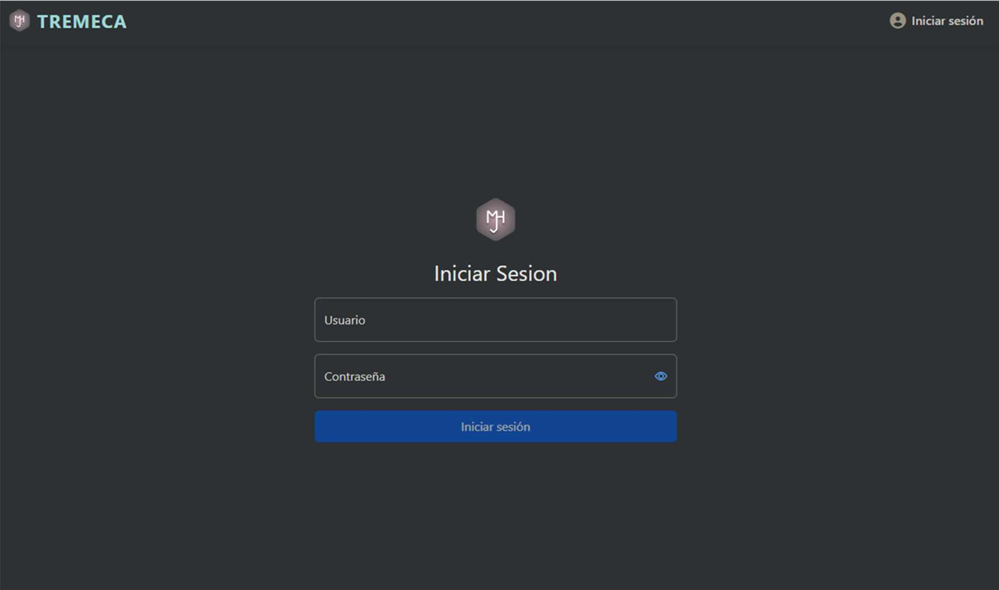
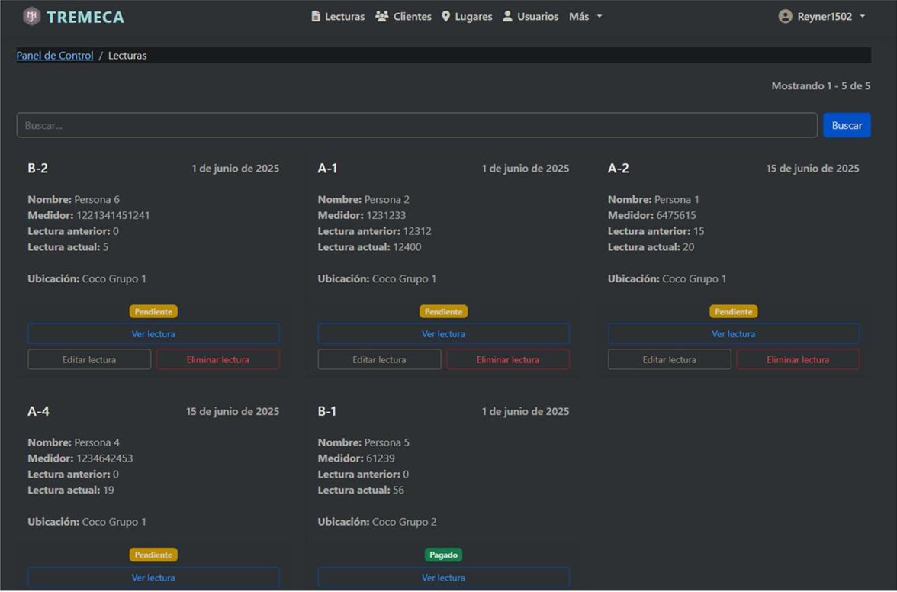

# Tremeca Backend – Django + DRF

Sistema backend diseñado para automatizar el registro, control y facturación del servicio de agua en TREMECA M&M S.A.
Incluye API REST completa, autenticación por roles, manejo de clientes, lecturas, pagos y generación de recibos térmicos en PDF.

--------------------------------------------------------------------------------
CARACTERÍSTICAS PRINCIPAL
--------------------------------------------------------------------------------
- Gestión de clientes (lotes, medidor, sector, lectura previa)
- Registro de lecturas desde la app móvil (React Native)
- Cálculo automático del consumo mensual
- Control de pagos, historial y estados de cuenta
- Generación de recibos PDF (80 mm para impresoras térmicas)
- Sistema de roles: Administrador, Cajero y Lector
- Panel administrativo en Bootstrap
- API segura con permisos por vista

--------------------------------------------------------------------------------
### Imagen (Login del sistema):

--------------------------------------------------------------------------------
TECNOLOGÍAS UTILIZADAS
--------------------------------------------------------------------------------
- Django 5.x
- Django REST Framework
- MySQL
- Bootstrap 5
- React Native (módulo móvil)
- ORM de Django
- JWT / Tokens

--------------------------------------------------------------------------------
### Imagen (Panel principal):

--------------------------------------------------------------------------------
IMPACTO DEL SISTEMA
--------------------------------------------------------------------------------
Reducción de errores:
20% → menos del 5%

Reducción del tiempo:
180 minutos → 30 minutos

--------------------------------------------------------------------------------
ROLES Y PERMISOS
--------------------------------------------------------------------------------
ADMIN:
    - CRUD completo
    - Usuarios
    - Reportes

CAJERO:
    - Registrar pagos
    - Ver historial

LECTOR:
    - Registrar lecturas
    - Ver clientes asignados

--------------------------------------------------------------------------------
ENDPOINTS PRINCIPALES
--------------------------------------------------------------------------------
Clientes:
    GET    /api/clientes/
    POST   /api/clientes/
    PUT    /api/clientes/{id}/
    DELETE /api/clientes/{id}/

Lecturas:
    POST   /api/lecturas/
    GET    /api/lecturas/{cliente_id}/historial/

Pagos:
    POST   /api/pagos/
    GET    /api/pagos/{cliente_id}/

Usuarios:
    POST   /api/auth/login/
    GET    /api/usuarios/

--------------------------------------------------------------------------------
### Imagen (Vista de lecturas):

--------------------------------------------------------------------------------
INSTALACIÓN
--------------------------------------------------------------------------------
- git clone <repo> 
- pip install -r requirements.txt 
- python manage.py migrate 
- python manage.py runserver 
